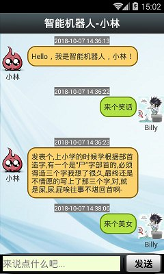
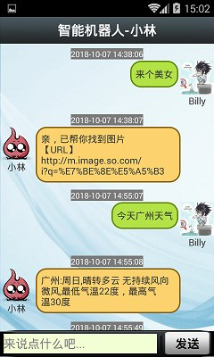
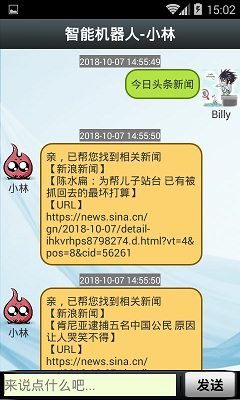

# 安卓智能聊天机器人(Android Smart Chat Robot)

## 项目介绍
这是一个使用ListView的Item多种布局来实现的智能聊天机器人，智能机器人的数据来自“图灵机器人”。 
智能机器人回复的消息若包含URL，则可长按消息来打开URL 
“图灵机器人”是一个可免费使用的智能的AI聊天回复接口，若要使用，需要提前在其官网进行注册并申请API Key！ 

### 效果图如下

  